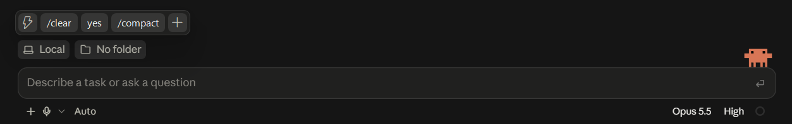
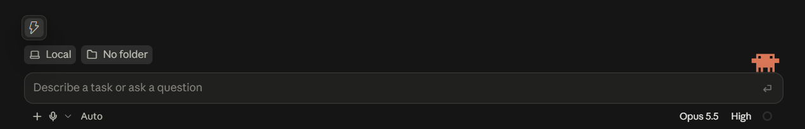
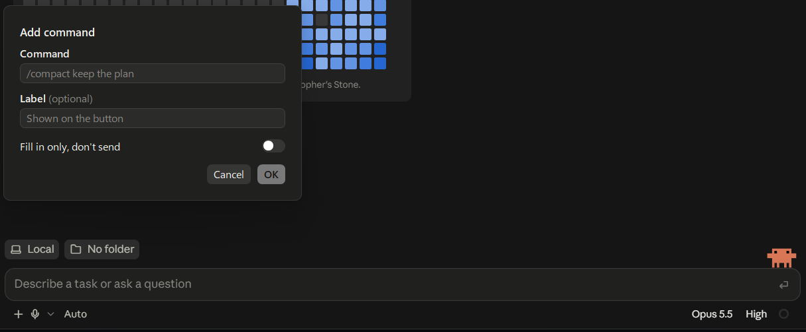

# quickbar

A small floating bar for the Claude desktop app on Windows: one click types a command such as `/compact` into the Code session in front of you, as if you had typed it yourself.





> [!IMPORTANT]
> **Unofficial.** quickbar is a third-party tool, not made, endorsed or supported by Anthropic. It works by finding Claude's prompt box on screen and typing into it, so an update to the Claude app may break it at any time.

## Install

1. Download `quickbar.exe` from the [latest release](https://github.com/seosy218-ops/claude-quickbar/releases/latest) and put it somewhere it can stay, such as `%LOCALAPPDATA%\quickbar\`. There is no installer.
2. Run it. The exe is not code-signed, so Windows may say **"Windows protected your PC"**: click **More info**, then **Run anyway**.
3. Open Claude. The bar shows on Claude's window whenever Claude is in front.

Only one copy runs at a time; starting it again does nothing.

### Build from source

With [Rust](https://rustup.rs) 1.88 or later:

```bash
cd desktop
cargo build --release
```

The exe lands in `desktop/target/release/quickbar.exe`.

## Use

- **⚡** folds the command buttons out and back in.
- **Click a command** to send it to Claude's Code prompt box. Whatever you had half-typed there is put back afterwards, and your clipboard is left as it was (the command does not show up in Win+V history either).
- **`+`** adds a command. Each command has the text to type (fixed arguments included, e.g. `/compact keep the plan`), an optional label for the button, and a switch **"Fill in only, don't send"** that leaves the command in the box, ahead of your draft, for you to finish and send.
- **Right-click a command** to edit or delete it. Right-clicking anywhere on the bar also offers **Quit**.
- **Drag a command** to move it among the others.
- **Drag the ⚡** to move the bar. It stays at that spot relative to the nearest corner of Claude's window, so it follows Claude when Claude is moved or resized.
- **Tray icon** (a ⚡ in the notification area): **Start with Windows** and **Quit**. Start with Windows starts this very exe at sign-in, so move the exe first, then tick it.



The bar follows Claude's light or dark theme, and hides while Claude is minimized or behind other windows.

## Configure

Everything the bar does is saved in `%APPDATA%\quickbar\config.json`, written the first time quickbar runs. You can edit it by hand; quickbar reads it at start, so quit from the tray and start it again afterwards.

```json
{
  "position": {
    "corner": "top_right",
    "x": -160,
    "y": 4
  },
  "commands": [
    {
      "command": "/compact",
      "mode": "send"
    },
    {
      "command": "/review",
      "label": "Review",
      "mode": "fill"
    }
  ]
}
```

| Field | Meaning | If left out |
|---|---|---|
| `position.corner` | The corner of Claude's window the bar keeps its distance from: `top_left`, `top_right`, `bottom_left` or `bottom_right`. | `top_right` |
| `position.x`, `position.y` | From that corner of Claude's window to the same corner of the bar, in pixels at 100% scaling. Negative is left or up. | `-160`, `4`: in Claude's title bar, left of the window buttons |
| `commands[].command` | The text typed into the prompt box. Required. | — |
| `commands[].label` | The button's text. | The command text |
| `commands[].mode` | `send` submits the command; `fill` leaves it in the box without submitting. | `send` |

With no `commands` at all, the bar starts with `/compact` and `/clear`.

Field names only ever get added, never renamed or removed, so a config file written for an older version keeps working. If the file cannot be read, the bar says **"Config file is invalid"**, runs with the defaults, and leaves your file untouched until you fix it.

## Limits

- Windows only, and only the Claude desktop app's **Code** page. On a chat or on settings the bar says **"No prompt box to type in"** and types nothing.
- It is a separate program rather than a Claude Code plugin because the desktop app does not let plugins draw anything in its window.

## Uninstall

Untick **Start with Windows** in the tray menu, **Quit**, then delete the exe and `%APPDATA%\quickbar\`.

## License

[MIT](LICENSE)
